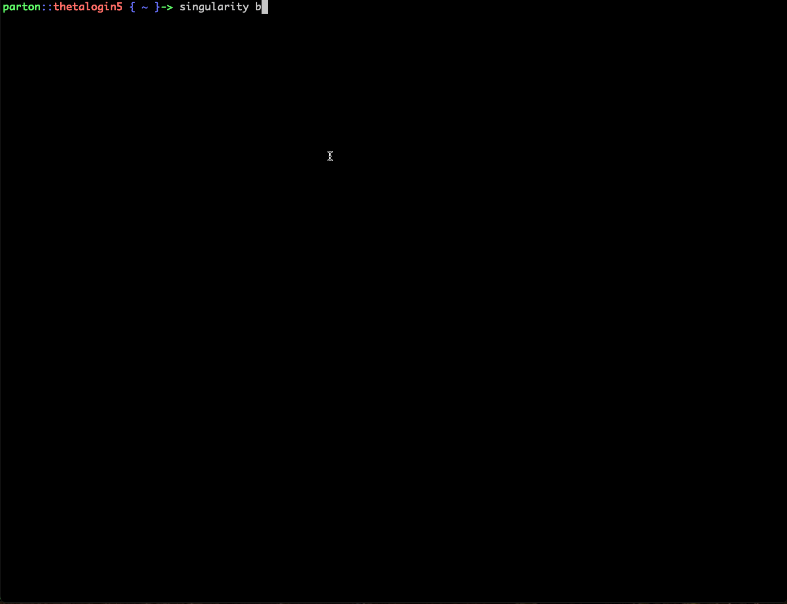

# Containers on Theta (KNL)

On Theta(KNL), the best method for container creation is to follow the Docker instructions on the first [README](../README.md). We'll start assuming those steps have been followed.

## Build Singularity image from DockerHub

Now that we have a docker image on Docker Hub, we can build our singularity container using the docker image as a source using

```bash
singularity build <image_name> docker://<username>/<repository_name>:<tag>
```

Here `image_name` is user defined & usually ends with `.sif` or `.simg`.

Example:



## Run Singularity container on Theta

```bash
qsub /path/to/CompPerfWorkshop/03_containers/Theta/job_submission_theta.sh </path/to/image_name>
```

## Example `job_submission_theta.sh`

First we define the job submission parameters (number of nodes `-n`, queue name `-q`, wall time `-t`, etc.) that are needed to submit a job on Theta(KNL), the number of ranks per node, and the container is passed as an argument to the submission script.

```bash
#!/bin/bash
#COBALT -t 30
#COBALT -q debug-flat-quad
#COBALT -n 2
#COBALT -A <project_name>
#COBALT --attrs filesystems=theta-fs0,home
RANKS_PER_NODE=4
CONTAINER=$1
```
Next we load the proper Cray MPICH module for MPI support on Theta. ABI (Application Binary Independent) simply means, we can build our application inside the image using the MPICH we installed there. Then, at run-time, we will use the `LD_LIBRARY_PATH` to point our application at Cray's MPICH libraries instead. ABI enforces the use of a common interface to enable this swapping in and out. Otherwise, this would fail.

```bash
# Use Cray's Application Binary Independent MPI build
module swap cray-mpich cray-mpich-abi
# Only needed when interactive debugging
#module swap PrgEnv-intel PrgEnv-cray; module swap PrgEnv-cray PrgEnv-intel
```

These `ADDITIONAL_PATHS` are the paths to dependencies from the Cray modules.

```bash
export ADDITIONAL_PATHS="/opt/cray/diag/lib:/opt/cray/ugni/default/lib64/:/opt/cray/udreg/default/lib64/:/opt/cray/xpmem/default/lib64/:/opt/cray/alps/default/lib64/:/opt/cray/wlm_detect/default/lib64/"
```

Now we add all these library paths to the `SINGULARITYENV_LD_LIBRARY_PATH` which will be used by Singularity to set the `LD_LIBRARY_PATH` environment variable inside the container at runtime.

```bash
# The LD_LIBRARY_PATH and/or PATH environment variables in a 
# Singularity container can be altered only using the SINGULARITYENV_LD_LIBRARY_PATH 
# or SINGULARITYENV_PATH environment variables prior to execution.
export SINGULARITYENV_LD_LIBRARY_PATH="$CRAY_LD_LIBRARY_PATH:$LD_LIBRARY_PATH:$ADDITIONAL_PATHS"
```

We need all the libraries to be accessible inside the container, therefore, we "bind-mount" the base path to all our dependencies using the `-B` option.

```bash
# need to mount these folders inside the container so that the Cray MPICH libraries will be found.
BINDINGS="-B /opt -B /etc/alternatives"
```

Next the actual run commands that combine the `aprun` launcher call that handles the MPI, and the `singularity` call to handle the containerized environment.

```bash
TOTAL_RANKS=$(( $COBALT_JOBSIZE * $RANKS_PER_NODE ))
# run my containner like an application
aprun -n $TOTAL_RANKS -N $RANKS_PER_NODE singularity exec $BINDINGS $CONTAINER /usr/source/mpi_hello_world
aprun -n $TOTAL_RANKS -N $RANKS_PER_NODE singularity exec $BINDINGS $CONTAINER python3 /usr/source/mpi_hello_world.py
```

The output should look like this:
```
Hello world from processor nid00020, rank 2 out of 8 processors
Hello world from processor nid00020, rank 3 out of 8 processors
Hello world from processor nid00020, rank 0 out of 8 processors
Hello world from processor nid00020, rank 1 out of 8 processors
Hello world from processor nid00021, rank 6 out of 8 processors
Hello world from processor nid00021, rank 7 out of 8 processors
Hello world from processor nid00021, rank 4 out of 8 processors
Hello world from processor nid00021, rank 5 out of 8 processors
Application 26449404 resources: utime ~14s, stime ~8s, Rss ~39912, inblocks ~64022, outblocks ~0
Hello world from processor nid00021, rank 7 out of 8 processors
Hello world from processor nid00021, rank 6 out of 8 processors
Hello world from processor nid00021, rank 5 out of 8 processors
Hello world from processor nid00021, rank 4 out of 8 processors
Hello world from processor nid00020, rank 2 out of 8 processors
Hello world from processor nid00020, rank 3 out of 8 processors
Hello world from processor nid00020, rank 1 out of 8 processors
Hello world from processor nid00020, rank 0 out of 8 processors
Application 26449405 resources: utime ~14s, stime ~8s, Rss ~39392, inblocks ~83290, outblocks ~0
```
