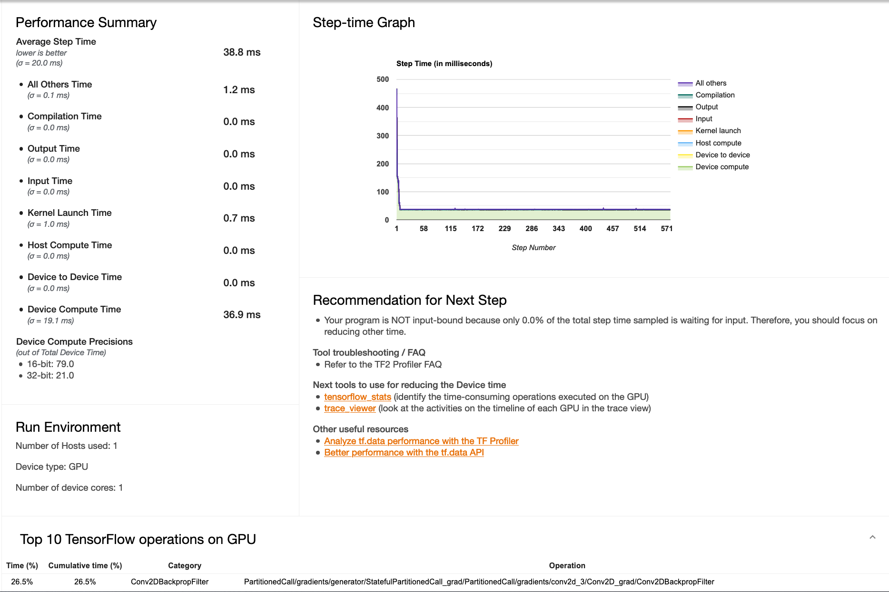
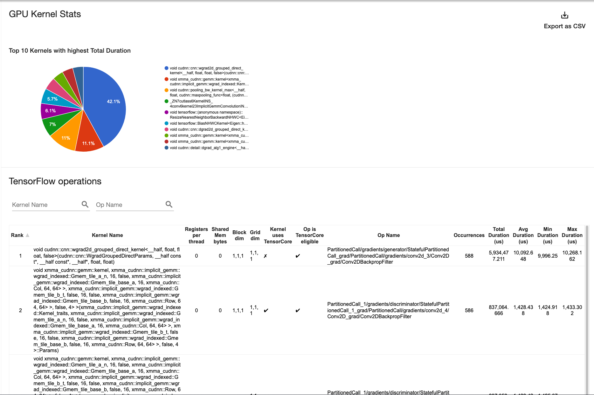
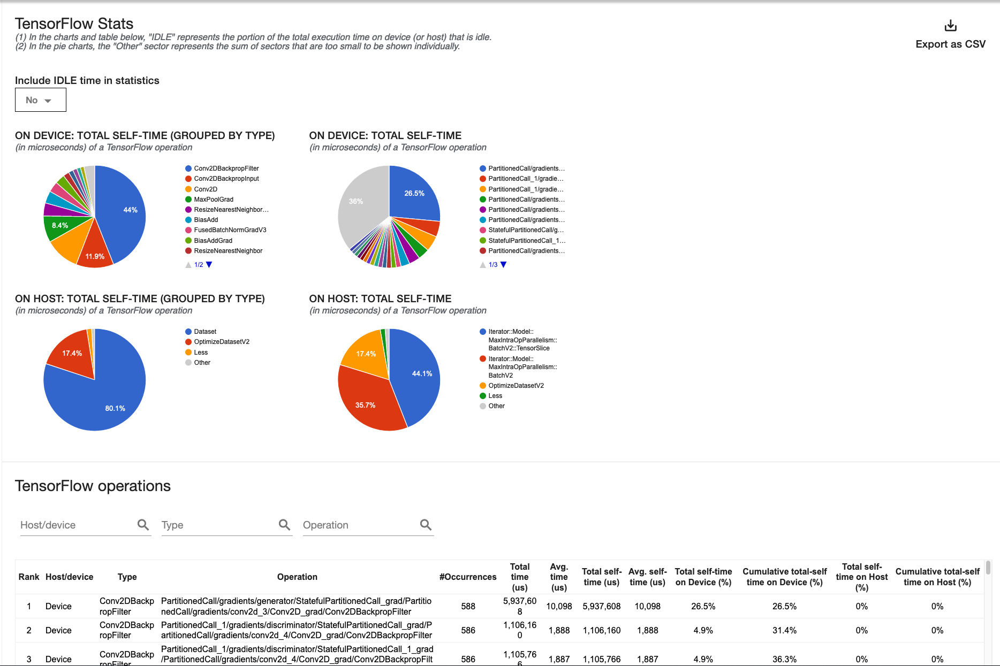
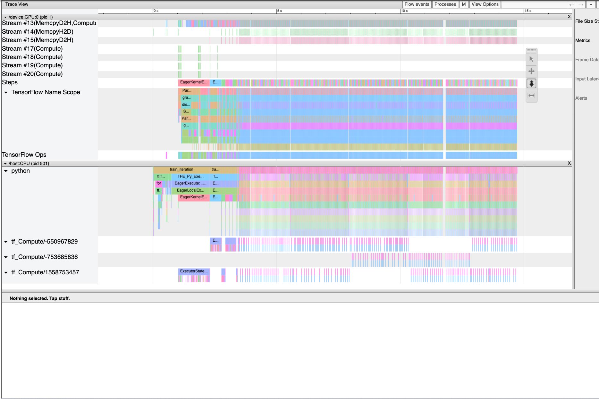
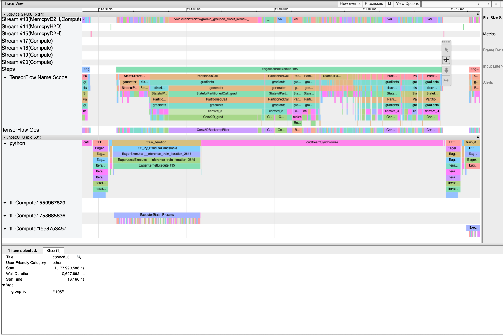

# Reduced Precision

Switching to reduced precision is not that hard in tensorflow:

```python
policy = tf.keras.mixed_precision.Policy("mixed_float16")
tf.keras.mixed_precision.set_global_policy("mixed_float16")
```

In this case, there are also a bunch of places where I hard-coded `float32` - oops!  Fix those too.

Next, run with mixed precision (profiling is still turned on here):

```
2021-04-28 21:24:47,079 - INFO - G Loss: 1.297, D Loss: 0.493, step_time: 0.200, throughput: 81943.425 img/s.
2021-04-28 21:24:47,279 - INFO - G Loss: 1.338, D Loss: 0.491, step_time: 0.200, throughput: 81944.206 img/s.
2021-04-28 21:24:47,479 - INFO - G Loss: 1.306, D Loss: 0.492, step_time: 0.200, throughput: 81977.345 img/s.
2021-04-28 21:24:47,680 - INFO - G Loss: 1.346, D Loss: 0.491, step_time: 0.200, throughput: 81911.681 img/s.
2021-04-28 21:24:47,880 - INFO - G Loss: 1.313, D Loss: 0.492, step_time: 0.200, throughput: 81956.031 img/s.
2021-04-28 21:24:48,080 - INFO - G Loss: 1.353, D Loss: 0.491, step_time: 0.200, throughput: 81871.669 img/s.
2021-04-28 21:24:48,280 - INFO - G Loss: 1.320, D Loss: 0.492, step_time: 0.200, throughput: 81990.353 img/s.
2021-04-28 21:24:48,480 - INFO - G Loss: 1.358, D Loss: 0.490, step_time: 0.200, throughput: 81811.531 img/s.
```

This is disappointing!  We ran with mixed precision and it is SLOWER.  Let's look into the profile to discover why.

Here's the overview page.  We note right away that in the bottom left, it IS using a good amount of reduced precision.



Scrolling down:


Compared to the float32 top-10 operations, this is pretty different.  There is one op that is particularly dominant!  It is still a conv2d operation, but for some reason it is much slower than the others.

Here is the Kernel Statistics page again:



We see the same problem there - except this time it's pointing to the wgrad convolution. The tensorflow statistics shows similar info:



And there is also a timeline view of all ops (trace viewer)



And zoomed:



So, reduced precision appears to be slower because of one particular operation.  How to fix this?  Well the best solution here is probably to open a bug report.

