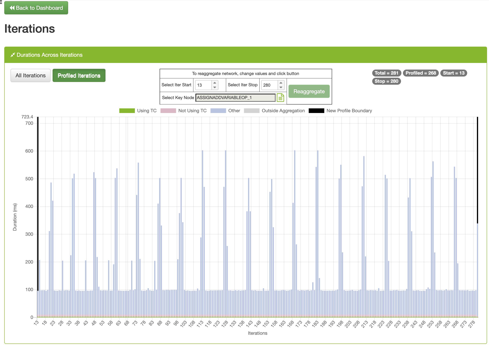

# Mixed Precision in TensorFlow

Here we will build on the GAN example from the previous profiling module.  We will by
default run the training for 4 epochs, each consisting of 14 iterations when the batch
size is 4096.

We will use the April 2021 release NVIDIA-optimiized NGC Singularity container for
TensorFlow 2.x in this walkthrough:
```
singularity exec --nv -B /lus /lus/theta-fs0/software/thetagpu/nvidia-containers/tensorflow2/tf2_21.04-py3.simg bash
```

<!-- ```
singularity exec --nv -B /lus /grand/projects/Comp_Perf_Workshop/containers/tf2_cpw.simg bash
``` -->

## Custom loss scaling

When discussing [reduced precision](../../09_profiling_frameworks/TensorFlow/reduced_precision/README.md) in the
profiling module,


In [`train_GAN_optimized.py`](train_GAN_optimized.py), we have added a few quality-of-life
improvements to this script, including:
- A switch at the top of the file to activate `float16` mixed precision


- A switch at the top of the file to enable *loss scaling*


<!-- Ensuring GPU Tensor Cores are used
As mentioned previously, modern NVIDIA GPUs use a special hardware unit called Tensor Cores that can multiply float16 matrices very quickly. However, Tensor Cores requires certain dimensions of tensors to be a multiple of 8. In the examples below, an argument is bold if and only if it needs to be a multiple of 8 for Tensor Cores to be used.

tf.keras.layers.Dense(units=64)
tf.keras.layers.Conv2d(filters=48, kernel_size=7, stride=3)
And similarly for other convolutional layers, such as tf.keras.layers.Conv3d
tf.keras.layers.LSTM(units=64)
And similar for other RNNs, such as tf.keras.layers.GRU
tf.keras.Model.fit(epochs=2, batch_size=128)
--> 


In the GAN, it shouldn’t make as big of a difference since the loss never gets so low that
you get near the clipping range, but it could matter.


## Manual profiling
If you grabbed a full DGX node, let's exclude all but one A100 GPU, since we are not
considering distributed training:
```
export CUDA_VISIBLE_DEVICES=0
```
By default, TensorFlow will allocate memory on every visible GPU, and the diagnostics for
the unused GPUs will annoyingly clog `STDOUT`. 


## NVIDIA DLProf

`nvidia-smi` has no way of showing Tensor Core utilization. Nor is it really exposed in
Nsight Systems. 

For deep learning software, we can use DLProf to profile TC utilization and more. 
This software lives on top of the Nsight Systems and Nsight Compute profilers. The results
can be dumped to CSV and/or visualized in TensorBoard. 

In TensorFlow 2.x, there is no universal marker for the beginning/end of a training
interation. Therefore, we must specify an operation ("node") which demarcates the
iteration boundary. Use the `--key_node` flag; [this
documention](https://docs.nvidia.com/deeplearning/frameworks/dlprof-user-guide/#find_good_key_node)
describes a two-step process for determining a good node/op. 

Also, we want to exclude the first handful of training iterations from profiling
statistics, sicne they are always slower due to XLA compilation, cuDNN heuristics, etc.:

```
dlprof --key_node=ASSIGNADDVARIABLEOP_1 --iter_start=15 python train_GAN_optimized.py
```

Note, `dlprof` will not complete successfully if you send `SIGINT` to your application. I
have also found that `--iter_stop` caused issues in the environment / with this particular
version. If you are on a single GPU interactive job, the profiler might fail to detect
AMP. 



